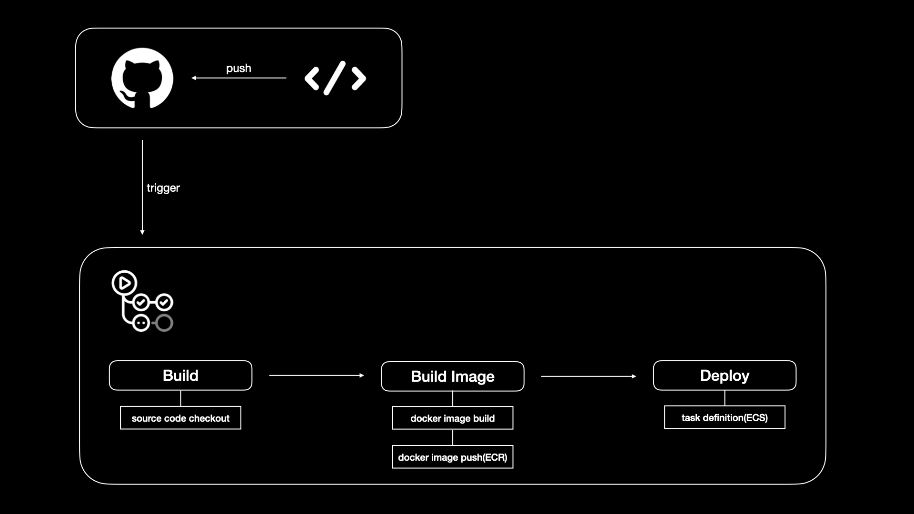

# #{PROJECT_NAME} [](https://www.python.org/downloads/) [](https://www.python.org/downloads/) [](https://www.python.org/downloads/)  

## Root Directory Structure
```
├── .github              # github action directory
├── .idea                # pycharm config directory
└── src                  # django project root directory
```


## Src Directory Structure
```
└── src
    ├── app              # django app directory
    ├── config           # django config directory
    └── templates        # django template directory
```

## App Directory Structure
```
└── app
    └── app_name
        ├── migrations
        ├── v1
            ├── filters.py
            ├── nested_serializers.py
            ├── paginations.py
            ├── permissions.py
            ├── serializers.py
            ├── tests.py
            ├── urls.py
            └── views.py
        ├── admin.py
        ├── apps.py
        ├── models.py
        ├── signals.py
        └── tasks.py
```

## Package
- [requirements.txt](src/requirements.txt)


## Set AWS Environments
1. `.env.temp` -> `.env` 복사
2. `.env`에 AWS 키 등록


## Install Virtual Environment & Dependency
```
# __PROJECT_ROOT__/backend
python -m venv .venv
source .venv/bin/activate
pip install -r requirements.txt
```


## Create Dummy Data
```
python manage.py dummy [app_name.model_name] -n 10
```


## Run Server
```
python manage.py runserver 0:8000
```


## API Document
- http://api.localhost:8000/swagger/


# CI/CD Pipeline

